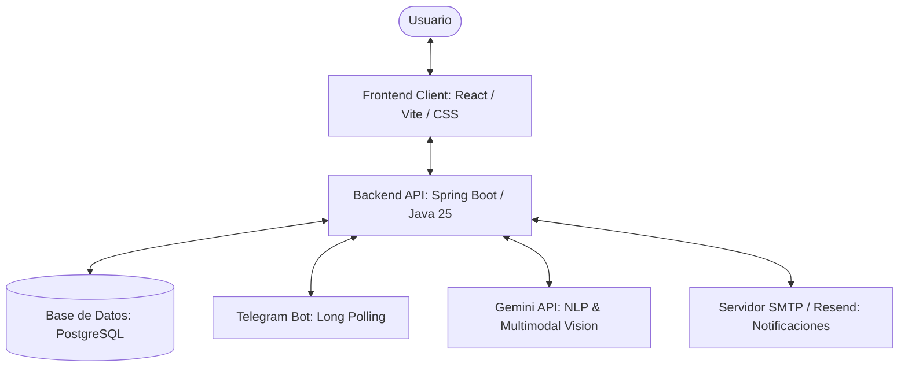

# 🪙 MyBalance — Plataforma de Gestión y Presupuesto Personal

MyBalance es una aplicación web premium diseñada para rastrear y optimizar tus finanzas personales con una estética sofisticada e inteligencia artificial integrada.

El proyecto está estructurado como un **Monorepo** moderno que consolida de manera ordenada la API del Backend (Java) y la aplicación del Frontend (React).

---

## ✨ Características Destacadas

*   **📱 Diseño Premium Responsivo:** Interfaz oscura elegante con efectos de glassmorphism, transiciones fluidas y layout adaptable (sidebar fijo en desktop, navegación móvil optimizada).
*   **🍕 Panel de Alimentación Semanal:** Monitorea tu presupuesto de comida de forma inteligente en tiempo real calculando consumos por semanas del mes.
*   **🤖 Inteligencia Artificial (Gemini):**
    *   Generación mensual programada de informes de ahorro hiper-personalizados en formato JSON enriquecido.
    *   Módulo de lectura multimodal para parsear imágenes de tickets/facturas de compras.
*   **💬 Bot de Telegram Multimodal:** Sube tus tickets o escribe transacciones mediante lenguaje natural en Telegram; el bot las interpreta por NLP (Gemini) y las registra en tu cuenta al instante.
*   **📧 Notificaciones Consolidadas:** Alertas automáticas por correo electrónico a las 7:00 AM recordando facturas y vencimientos de presupuestos del día.

---

## 🏗️ Arquitectura Técnica

El ecosistema de MyBalance consta de los siguientes componentes principales:



---

## 🚀 Arranque Rápido con Docker Compose

La forma más rápida de levantar toda la plataforma localmente es usando **Docker Compose**.

### 1. Requisitos previos
*   Tener instalado [Docker Desktop](https://www.docker.com/products/docker-desktop/) (que incluye Docker Compose).

### 2. Ejecutar la aplicación
Desde la raíz del monorepo, ejecuta:
```bash
docker compose up --build
```

### 3. Acceder al sistema
Una vez que los contenedores inicien:
*   **Frontend (Cliente Web):** Accede a [http://localhost](http://localhost).
*   **Backend (Documentación API Swagger):** Consulta [http://localhost:8080/swagger-ui.html](http://localhost:8080/swagger-ui.html).
*   **Base de Datos (PostgreSQL):** Disponible en el puerto local `5432` con credenciales `postgres/postgres`.

---

## 🛠️ Desarrollo Local (Sin Docker)

Si deseas correr los componentes de manera nativa para desarrollo activo:

### Backend
1.  Navega a la carpeta `/back`.
2.  Crea un archivo local para secretos: `/back/src/main/resources/application-local.yml` (Ignorado por Git). Define allí tu token de Telegram y llave de Gemini:
    ```yaml
    telegram:
      bot:
        token: "TU_TOKEN"
        username: "TU_BOT_NAME"
    gemini:
      api:
        key: "TU_GEMINI_KEY"
    ```
3.  Levanta PostgreSQL en tu máquina local.
4.  Ejecuta la API:
    ```bash
    ./mvnw spring-boot:run
    ```

### Frontend
1.  Navega a la carpeta `/front`.
2.  Instala las dependencias:
    ```bash
    npm install
    ```
3.  Crea un archivo `.env` o utiliza el valor por defecto:
    ```env
    VITE_API_URL=http://localhost:8080/api/v1
    ```
4.  Inicia el servidor de desarrollo Vite:
    ```bash
    npm run dev
    ```

---

## 📖 Documentación Interna

Para detalles más específicos de la lógica de negocio y esquemas, puedes explorar la documentación dentro de los subdirectorios:
*   [Esquema y Modelo de Datos (DBML)](file:///D:/repos/mybalance/monorepo/front/docs/db.dbml)
*   [Especificaciones del Sistema de Cuentas](file:///D:/repos/mybalance/monorepo/front/docs/feature_cuentas.md)
*   [Especificaciones del Sistema de Presupuestos](file:///D:/repos/mybalance/monorepo/front/docs/feature_presupuestos.md)
*   [Mapeo de Categorías y Transacciones](file:///D:/repos/mybalance/monorepo/front/docs/cats_transactions.md)

---

## 📄 Licencia

Este proyecto está bajo la Licencia **MIT**. Consulta el archivo [LICENSE](file:///D:/repos/mybalance/monorepo/LICENSE) para más detalles.
